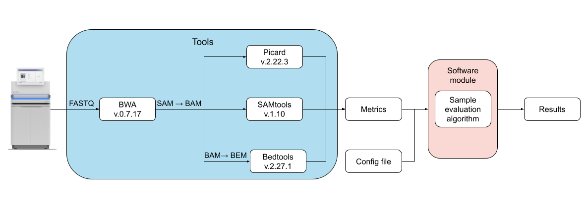

# Liquid biopsy QC tool

## Overview
This is a robust software tool developed as part of a Master's thesis titled "Analysis of Quality Control Data for Liquid Biopsy Samples Based on Cell-Free DNA Using NGS." The tool provides comprehensive quality control validation for liquid biopsy samples by implementing analytical quality control criteria (AQCC) tailored for cell-free DNA sequencing data.

The primary objective of the tool is to evaluate the quality of liquid biopsy samples by analyzing key metrics from NGS data and providing clear interpretation of sample suitability for downstream analysis, such as variant calling, copy number variation analysis, and gene expression profiling.

## Features

- Automated analysis of critical QC metrics
- Customizable thresholds for different sample types
- Comprehensive QC report generation
- Easy integration with existing NGS pipelines
- Interpretation of biological implications for failing metrics

## Quality Metrics

This tool analyzes the following key metrics to determine sample quality:

| Tool | Metric | Description | Threshold | Biological Interpretation |
|------|--------|-------------|-----------|--------------------------|
| SAMtools | Duplicate percentage | Fraction of unique reads after duplicate removal | > 90% | Insufficient input DNA for library prep |
| SAMtools | Off-target reads | Percentage of reads outside priority regions | > 30% | Inefficient sample washing |
| Coverage Analysis Module | Mean coverage | Average coverage of priority regions | Ratio < 1.5 (priority 1 vs. priority 2) | Possible biological sample issues or insufficient input material |
| Coverage Analysis Module | Coverage completeness | Percentage of fully covered priority regions | < 60% | Uneven sample coverage |
| Picard | Insert size | Fraction of reads with an insert size ≤150 bp | N/A | Qualitative assessment |
| Overall Count | Total reads | Total read count in FASTQ files | < 200M | Insufficient library complexity |

## Pipeline Overview

The following diagram shows the main stages of the QC tool result generation pipeline:



## Output

The tool generates a structured JSON report containing:

1. **Meta Information**:
   - Sample ID
   - Configuration version
   - Date of analysis

2. **QC Checks**:
   - **Coverage Ratio Check**: Evaluates the ratio between priority 1 and priority 2 gene coverage
   - **Coverage Completeness Check**: Analyzes the percentage of fully covered priority regions
   - **Duplicate Percentage Check**: Verifies if duplicate rate is within acceptable limits
   - **Off-target Reads Check**: Ensures capture efficiency is adequate
   - **Total Reads Check**: Confirms sufficient sequencing depth

3. **Estimations**:
   - **Minimal VAF and LoD**: Estimates the theoretical limit of detection
   - **Insert Size Analysis**: Reports the fraction of reads with small insert sizes (≤150 bp)

Each check has a status (success, warning, or error) and a detailed message explaining the result. For certain checks, additional data is provided, such as lists of affected genes. This comprehensive report helps laboratory personnel quickly assess sample quality and make informed decisions about proceeding with downstream analysis.

Example output:
```json
{
    "meta": {
        "sample_id": "Sample_0001",
        "config_version": "0.0.0",
        "date": "2024/04/18, 13:58:36"
    },
    "stages": {
        "checks": [
            {
                "name": "average_coverage_v1/average_coverage_v2 ratio",
                "status": "success",
                "message": "average_coverage_v1/average_coverage_v2 ratio is higher than 1.5; check passed."
            },
            ...
        ],
        "estimations": [
            ...
        ]
    }
}
```
